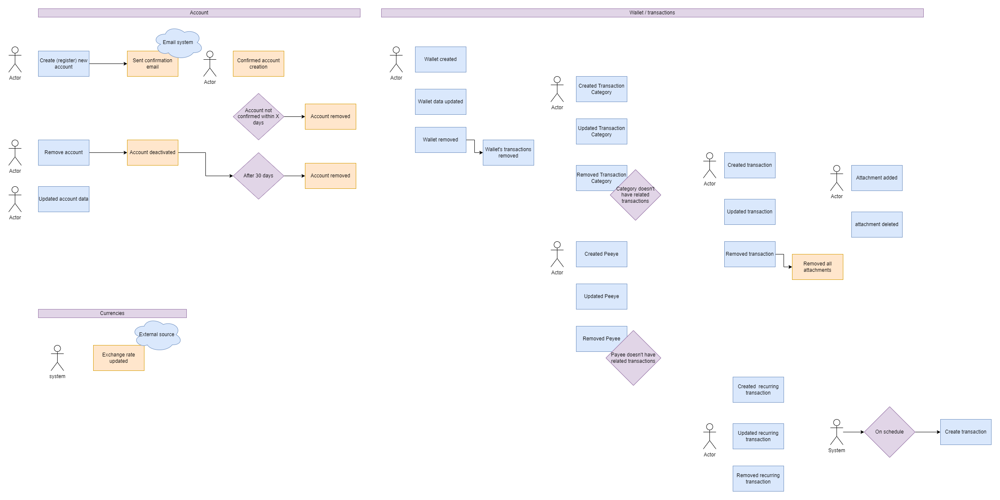
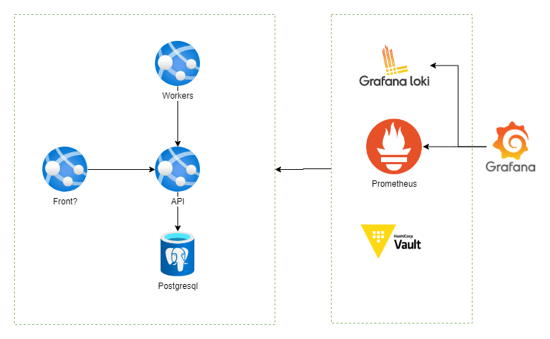

# Overmoney

Overmoney - web app for personal finances management

Inspiration: https://moneymanagerex.org/

## Features

- [ ] Ability do create account/login via email
- [x] Support for multiple wallets
- [x] Support for multiple currency
- [x] Detailed transaction log including date, payee, category etc.
- [ ] Ability to add attachment to each transaction (eg. invoices, photos)
- [ ] Dashboards to easy track current expenses
- [x] Support for reccuring transaction
- [x] Budget planner
- [ ] Weekly/Monthly summaries send to email

## Layout

- For layout check [here](/docs/Layouts.md)

### Nice to have

- [ ] Login via Google/Microsoft
- [ ] Support for mobile devices
- [ ] Splited transaction (multiple categories for single transaction)

## Roadmap

| Name                                                                | Deadline   | Status      |
| ------------------------------------------------------------------- | ---------- | ----------- |
| README + plan                                                       | 2024.03.04 | ✅ Done     |
| Features without dashboards & budget planner & files (API only)     | 2024.03.15 | ✅ Done     |
| Features (files, reccuring transactions, budget planner) + database | 2024.04.03 | ✅ Done     |
| CI/CD (build), tests, Frontend (setup)                              | 2024.04.14 | ✅ Done     |
| Frontend - all view                                                 | 2024.05.12 | In Progress |
| CI/CD + IaC (containers, networking), Security, Observability,      | 2024.05.19 | Todo        |
| dashboards, summaries                                               | 2024.05.26 | Todo        |
| Nice to have feature                                                | 2024.06.08 | Todo        |

## Technology

List of technologies, frameworks, libraries used for implementation:

### Backend:

- [.NET 8.0](https://dotnet.microsoft.com/en-us/) (platform)
- [Docker](https://www.docker.com/)
- [Entity Framework Core](https://learn.microsoft.com/en-us/ef/) - ORM
- [Posgresql](https://www.postgresql.org.pl/) - Database engine
- [Fluent Validation](https://fluentvalidation.net/) - Initial endpoint data validation
- Mediatr - CQRS pattern implementation
- XUnit - Testing framework
- [Fluent Assertion](https://fluentassertions.com/) - Unit & Integration tests
- [Shouldly](https://shouldly.org) - Unit & Integration tests
- [Test Containers](https://dotnet.testcontainers.org/) - Integration tests (emulating database etc.)
- more in future...

### Frontend:

- [VueJS](https://vuejs.org/) - Frontend framework
- more in future...

## Containers

## Things to learn

List of technologies, frameworks, libraries that I want to learn/test:

### Frameworks/Libraries

- [ ] ASP.NET Core (Security, OAuth)
- [ ] Dapper
- [ ] Worker Services / Hangfire
- [ ] Integration/E2E Tests

### Infra

- [ ] CI/CD (GitHub) including automatic build, test, deployment, database migrations
- [ ] IaC (Bicep)
- [ ] Observability: Loki, Grafana, Prometheus, Jaeger, "sth for alerting"
- [ ] Hashicorp Vault
- [ ] RabbitMQ
- [ ] Azure Containers, networking

## How to run

todo
